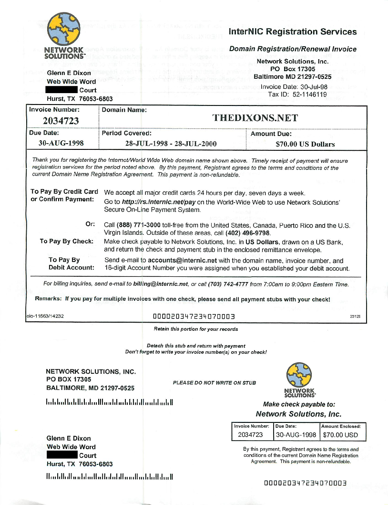
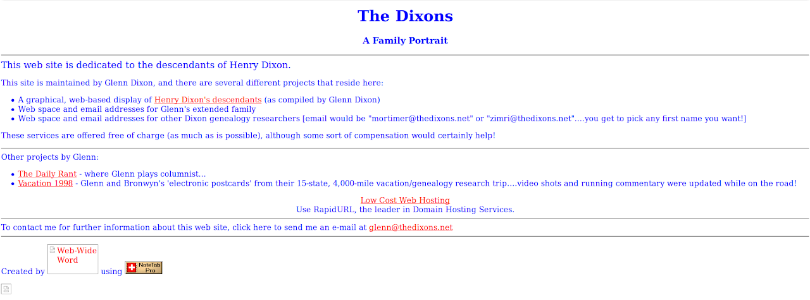
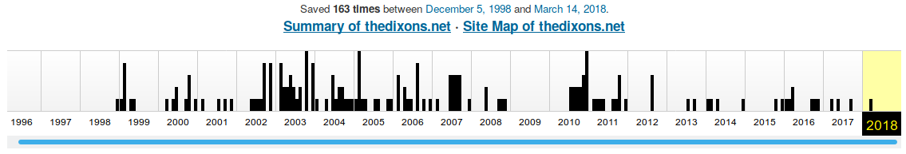

+++
title = "Twenty-Four Years of TheDixons.net"
weight = 0
+++

## Twenty-Four Years of TheDixons.net

I can't believe I have owned a domain name for its entire 24-year history! This main domain [thedixons.net](http://thedixons.net) was first registered 24 years ago as of July 28, 2024. Here is a copy of the original domain name registration. $70 for two years! (click to embiggen)

Here is a sample page from Archive.org's 'Wayback Machine'

Some interesting notes on that early version:

* That's some seriously minimalist html there! 
* Yes, my 'blog' was called The Daily Rant - hand-coded w/ vbScript, ASP, served via IIS and MSAccess
* Yes, I had vacation pics and stories.
* Yes, I had a really cheesy web company name (WWW=World Wide Web -&gt; Web Wide Word) - get it, I was 'getting' the 'word' out on the web!!! Genius marketing there
* Oh yes, I totally coded the whole thing using Note Tab Pro. 

Archive.org grabbed 163 snapshots of the site in 20 years. There were periods where the site was not active as I kept changing my mind on servers, software and the overall focus. [NOTE: as I write this update the Wayback Machine is offline - I am unable to update this image].

I'm very proud of this, in a nerdy sort of way, of course.
