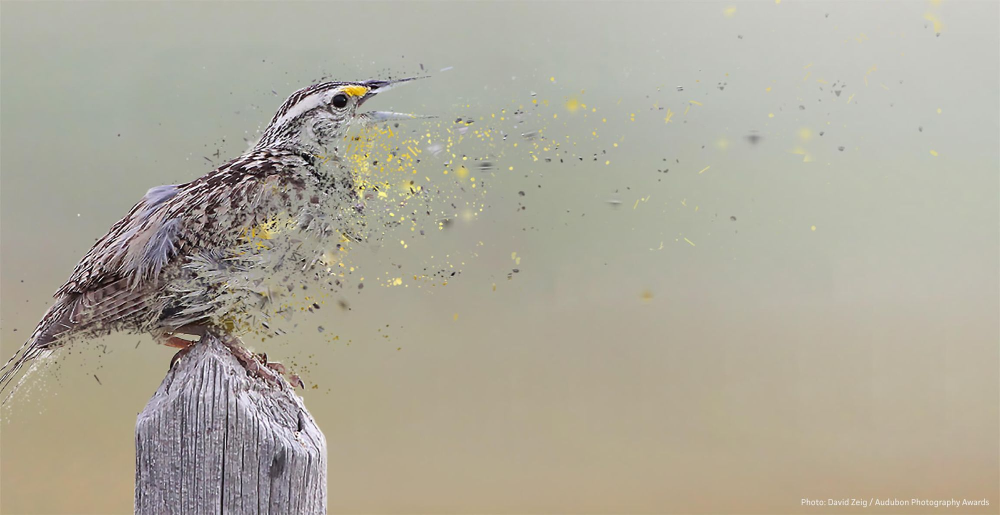

+++
title = "Disappearing Birds"
weight = 4
+++

## Disappearing Birds

A recent example of ‘[speculative extinction](../speculative-extinctions)’ is the recent study/publicity campaign regarding North American bird population.

[Original Paper](https://www.science.org/doi/full/10.1126/science.aaw1313)

[3 Billion Birds](https://www.3billionbirds.org/)

Clarification and thoughts from Brian McGill’s Dynamic Ecology blog:

> “they estimate the total number of individuals of each species found in North America (excluding Mexico) from an extrapolation from data covering a fraction of a percent of the US.”

> “Wouldn’t we be much better off to say: a few species have declined drastically, a few have increased drastically many haven’t changed that much? This is a general pattern, not just in these birds.”

From the comments section:

> “I hope it was clear in my post that I respect what was done by the authors. My main thoughts are what the journalists are going to do with this (not the responsibility of the scientists). We are going to create an impression that birds are on their way out. And 20 years from now when they’re still very much around but differently composed, that is going to bite our credibility.” - Brian McGill

> “if you look closely at the data, the great majority of the decline happened before 2000. Counting habitat groups, 40% are stable or increasing since 2000. Everything declined Pre 2000.” - rccarl

> “migratory songbirds are showing most of the declines – which might be more about their subtropical/tropical winter habitat (or their migratory corridors).” - Brian McGill

> “First, is it even valid to sum up across all bird species? After >65 MY of divergence, do sparrows, hummingbirds, cormorants, and loons really have much in common any more? Do they live in similar habitats, eat the same food, have a common physiology, or share the same habits? If the answer is no, then any changes in the sum can’t be attributed to any general causes. And if they’re the sum of many separate causes that apply to different groups, then a priori the changes in the sum are due to the trends of the most populous species and habitats. Which as you say are just the ones that raise the fewest concerns.” - Joseph Ycas

[Did North America really lose 3 billion birds? What does it mean?](https://dynamicecology.wordpress.com/2019/09/20/did-north-america-really-lose-3-billion-birds-what-does-it-mean/)

Further analysis in great detail (long read):

[No We Do Not Risk Birds Vanishing From The US Skies - And Have We Really Lost 3 Billion Birds Since 1970?](https://www.science20.com/robert_walker/no_risk_of_extinction_of_common_birds_in_us_and_have_we_really_lost_3_billion_birds-242037)