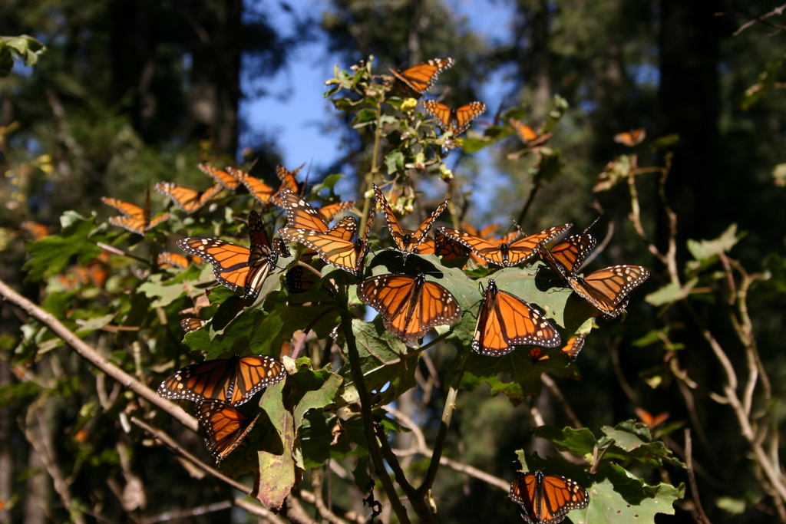

+++
title = "Monarch Butterflies"
weight = 6
+++

## Monarch Butterflies

Are Monarch Butterflies Going Extinct?

Things to expand on

* Population Estimates
* WWF Mexico Weird Control of Reserve Areas
* No unapproved researchers allowed
* Our trip to Cerro Pelon reserve in early 2020

> “Collaboration with WWF-Mexico is key, however; due to an agreement with the Mexican government, only the organization and employees of Mexico’s Monarch Butterfly Biosphere Reserve are allowed to measure these monarch colonies.”

[We need a better way to measure monarch populations](https://scienceline.org/2018/04/need-better-way-measure-monarch-populations/)

This quote matches information given to us by the owners of the BnB where we stayed during our visit.