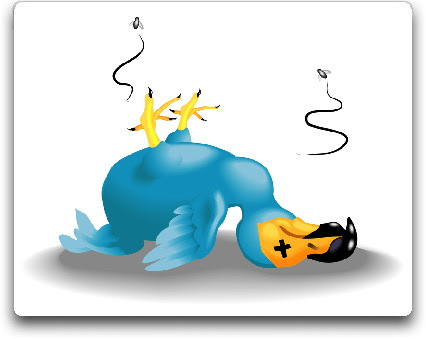
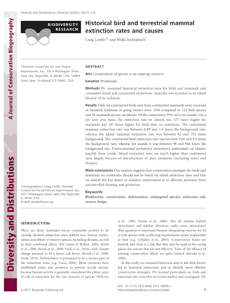
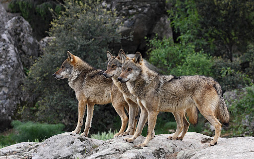

+++
title = "Speculative Extinctions"
weight = 8
+++

last updated October 26, 2021 6:26 AM (CDT)

## Speculative Extinctions

### Seeds of Doubt

The first seeds of doubt in my mind re: the ‘consensus’ view on climate change came about in a rather roundabout way. First, I was reading about yet another dire astronomical number of extinctions that were already under way both now and in the near future (caused, at least in part, by climate change). But this time something snapped and I just couldn’t believe the numbers. So many numbers were being thrown out on a regular basis, and yet no actual newly-extinct species were being named. I dug in.

### Species-Area Relationship

Research led me to realize that almost all recent articles about mass extinctions were estimates – estimates! – based on the (flawed) concept of ‘species-area relationship’ (SAR) - yet documented habitat loss results in very few extinctions, as species tend to be much more resilient and less dependent on specific habitats than the concept theorizes. They hunker down or find new habitats.

> Extinction from habitat loss is the signature conservation problem of the twenty-first century. Despite its importance, estimating extinction rates is still highly uncertain because no proven direct methods or reliable data exist for verifying extinctions.

[Species-area relationships always overestimate extinction rates from habitat loss - PubMed](https://pubmed.ncbi.nlm.nih.gov/21593870/)

Following are two links - the first is the original blog post. Yes, it is on a web site that climate change alarmists scorn, having been firmly branded as 'cLiMaTe DeNiErS'. This does not alter the fact that it contains math and calculations which you can easily check. The second is the resulting white paper. The first is more readable, the second more methodological. I am adding these on Aug. 5, 2021, long after I originally concluded that SAR, as normally applied, is flawed.

> by Willis Eschenbach - Abstract - The record of continental (as opposed to island) bird and mammal extinctions in the last five centuries was analyzed to determine if the “species-area…

[Where Are The Corpses?](https://wattsupwiththat.com/2010/01/04/where-are-the-corpses/)

> We examined historical extinction rates for birds and mammals and...

### Species Over-counting

Additionally, estimates of existing species are wildly over-counted. Marine species estimates were roughly halved after removing duplicates from the main database at the World Register of Marine Species (228,000 instead of 418,000). This might also reduce the number of other known species from 1.9 million to 1.5 million.

> Is it 150 species a day or 24 a day or far less than that? Prominent scientists cite dramatically different numbers when estimating the rate at which species are going extinct. Why is that?

[Global Extinction Rates: Why Do Estimates Vary So Wildly?](https://e360.yale.edu/features/global_extinction_rates_why_do_estimates_vary_so_wildly)

If you can’t count them, how would you know if they actually went extinct? Furthermore, the vast majority of bird, mammal and reptile extinctions have occurred on isolated islands.

Throughout 3.8 billion years of evolution on Earth, the inexorable trend has been toward an ever greater variety of species. With the past two mass extinction events there were soon many more species alive after each catastrophe than there were before it.

> The idea that we are edging up to a mass extinction is not just wrong – it’s a recipe for panic and paralysis

[We are not edging up to a mass extinction](https://aeon.co/essays/we-are-not-edging-up-to-a-mass-extinction)

Yet species estimates continue to be speculated at insanely large numbers. 100 million 1 Trillion (!) has frequently been cited. Recently that number has been narrowed down considerably. Current estimates are this side of 9 million. But that means that scientists believe that somehow 7 million different species have managed to remain hidden and undiscovered. Almost all of these are microscopic.

### The Rarity of Extinctions

Then there’s the [IUCN](https://iucn.org). They have a problem. On one hand, they are very much beating the drum about how dire the situation is. They want to make sure the enviro-left knows they are on their side, fighting the good fight, trying to save our planet’s species from imminent extinction. On the other hand, they are the keepers of the ‘official’ numbers of extinct species. 877 extinctions since 1500. That’s 1.68 species per year. While any extinction is bad, it’s hard to get people worried by touting numbers like “almost two species per year go extinct.”

Further writing on related topic: [Disappearing Birds](07.disappearing-birds)

The 2019-2020 bushfires in Australia have produced sensational headlines. The projected animal death toll was 400 million, then half a billion, then 800 million, and finally, predictably, a billion. And then ‘many, many billions.’ (is any estimate too high?) (update: evidently not - now TRILLIONS)

> AUSTRALIA’S wildfires could lead to the loss of life of up to a TRILLION species, an expert has alarmingly warned.

Australia fires: Up to a TRILLION animals could die in the fires, expert warns
**ARTICLE DELETED **- evidently someone was embarassed at the gross exaggeration and the article can no longer be found on the Express.co.uk web site...

On top of that, many _species_ will/may go extinct (depending on which headline you read on which date).

The WWF says 10,000 - 100,000 species will go extinct each year. This is based on something called the ‘background extinction rate’ - with claims of ‘literally dozens’ of species going extinct every day.

Given the actual extinction rate, 1.68 per year, it is difficult to make these numbers line up. Dozens would mean a minimum of 8,760 species extinctions per year.

1.68 vs 8,760.

Basically the argument seems to be that this estimate must be right and lays the blame on the fact that species and populations are hard to document and count. So, basically, just ‘we’re pretty sure it’s true so trust us.’

> A projected spate of extinctions of animals and plants this century may be less drastic than feared because the most widely used scientific method can exaggerate losses by more than 160 percent, a study said on Wednesday.

[Plant, animal extinctions often exaggerated: study](https://www.reuters.com/article/us-extinctions/plant-animal-extinctions-often-exaggerated-study-idUSTRE74H5D620110518)

An interesting quote:

> I worry how many more years scientists (and reporters) can report catastrophic trendlines that predict little to no life of any sort on the planet within our lifetimes and not have people notice that this isn’t actually happening.

Source: Dynamic Ecology blog -

> So the 2020 version of the Living Planet Report has been released to massive headlines blaring catastrophe. The central claim is that vertebrate (i.e. fish, amphibian, reptile, bird, mammal) local …

[Here we go again – the planet is practically dead](https://dynamicecology.wordpress.com/2020/09/10/here-we-go-again-the-planet-is-practically-dead/)

All of this reading up on extinction rates and population estimates caused me to see a problem in the so-called ‘science’ around all of this. I still have complete faith in the ‘scientific process.’ But I have begun to lose faith in what we generally call ‘science’ - specifically, the academic community and the peer review system. That shit is just fucked beyond saving! And it is also the source of almost all science that is ever covered by the news media. More on that later. But first, let’s talk about 🌊[sea_levels](09.sea-levels)
